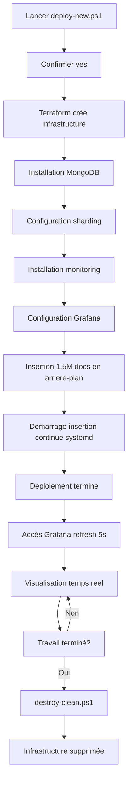
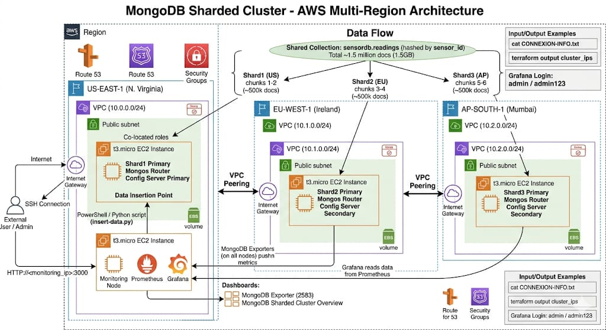

# MongoDB Sharded Cluster - AWS Multi-Region

Infrastructure MongoDB shardée automatisée sur 3 régions AWS avec monitoring en temps réel.

## 🚀 Démarrage Rapide

### **Déploiement Complet (20-30 minutes)**

```powershell
# 1. Ouvrir PowerShell dans ce répertoire
cd C:\Users\<username>\Desktop\lot\mongodb-cluster

# 2. Lancer le déploiement
.\deploy-new.ps1

# 3. Confirmer avec "yes"

# 4. Attendre ~25 minutes
```

### **Destruction Complète (5-10 minutes)**

```powershell
# 1. Lancer la destruction
.\destroy-clean.ps1

# 2. Confirmer avec "yes"
# 3. Confirmer avec "DESTROY"
```

**Si destruction échoue:**
```powershell
.\destroy-force.ps1
```

---

## 📊 Ce Que Vous Obtenez

✅ **Infrastructure AWS:**
- 3 VPC multi-régions (US-EAST-1, EU-WEST-1, AP-SOUTH-1)
- VPC Peering cross-région
- 4 instances EC2 t3.micro (Free Tier)

✅ **MongoDB Cluster:**
- 3 Shards (un par région)
- 3 Config Servers (replica set)
- 3 Mongos Routers
- **1.5 million de documents** pré-insérés (~1.5 GB)
- **Insertion continue** en arrière-plan (service systemd, ~100 docs/s, s'arrête au destroy)
- Sharding automatique configuré

✅ **Monitoring temps réel (latence 5-10s):**
- Prometheus (scrape interval 5s, retention 3j)
- Grafana (dashboards auto-refresh 5s)
  - Dashboard MongoDB (ID 2583)
  - Dashboard personnalisé avec panels par shard (US/EU/AP)
- Exporters MongoDB avec `--collect-all` + `--mongodb.collstats-colls`
- Scraping cross-region via IPs publiques (pas de VPC peering requis pour monitoring)

---

## 🎯 Accès et Visualisation

### **Grafana** (après déploiement)

```
URL:      http://<monitoring_ip>:3000
Login:    admin
Password: admin123
```

**Dashboards disponibles:**
- MongoDB Exporter (métriques détaillées)
- **MongoDB Sharded Cluster - Overview** (personnalisé, refresh 5s, fenêtre 5min) :
  - Total Documents (sensordb.readings)
  - Documents par Shard (piechart)
  - Opérations par Seconde (insert/query/update/delete)
  - Insertions par Shard (rate 30s)
  - Connexions actives par Shard
  - **Shard US / EU / AP** (stats individuels colorés)
  - **Evolution des documents par Shard** (courbes temps réel)

**Récupérer l'IP de monitoring:**
```powershell
# Depuis le fichier de connexion
cat CONNEXION-INFO.txt

# Ou depuis Terraform
(terraform output -json | ConvertFrom-Json).cluster_ips.value.monitoring.public
```

---

## 📈 Monitoring de l'Insertion en Temps Réel

L'insertion initiale (1.5M docs) est lancée **en arrière-plan** (nohup + &), donc Terraform rend la main immédiatement et vous pouvez suivre la progression pendant qu'elle tourne.

### **Option 1: Grafana (recommandé)**
Ouvrir http://<monitoring_ip>:3000 → dashboard **"MongoDB Sharded Cluster - Overview"**. Refresh auto toutes les 5s.

### **Option 2: Script de monitoring intégré**
```powershell
.\monitor-insertion.ps1
```

Choisissez parmi:
1. **Logs en direct** (tail -f)
2. **Compteur temps réel** (mise à jour 10s)
3. **Mode parallèle** (les deux)

### **Option 3: Logs détaillés**
```powershell
# Insertion initiale (1.5M docs)
ssh -i ~/.ssh/id_rsa_mongodb-sharded-cluster bigdata@<us_ip> "tail -f /tmp/insertion.log"

# Insertion continue (jusqu'au destroy)
ssh -i ~/.ssh/id_rsa_mongodb-sharded-cluster bigdata@<us_ip> "tail -f /tmp/continuous-insert.log"
```

### **Contrôle de l'insertion continue**
```bash
# Statut
ssh bigdata@<us_ip> "sudo systemctl status continuous-insert"

# Arrêter
ssh bigdata@<us_ip> "sudo systemctl stop continuous-insert"

# Redémarrer
ssh bigdata@<us_ip> "sudo systemctl start continuous-insert"
```

---

## 🔧 Scripts Disponibles

| Script | Description | Durée |
|--------|-------------|-------|
| `deploy-new.ps1` | Déploiement complet de l'infrastructure | 20-30 min |
| `destroy-clean.ps1` | Destruction propre avec vérifications | 5-10 min |
| `destroy-force.ps1` | Destruction forcée (en cas d'urgence) | 5-10 min |
| `apply-grafana-config.ps1` | Configure Grafana sur infra existante | 1 min |
| `monitor-insertion.ps1` | Monitoring temps réel de l'insertion | - |
| `cleanup-obsolete.ps1` | Nettoie fichiers obsolètes | 1 min |

---

## 🗂️ Structure du Projet

```
mongodb-cluster/
├── 📄 Terraform (13 fichiers .tf)
│   ├── versions.tf              # Versions providers
│   ├── providers.tf             # Configuration AWS multi-région
│   ├── variables.tf             # Variables configurables
│   ├── locals.tf                # Variables locales
│   ├── network.tf               # VPC, subnets, IGW
│   ├── network-fixes.tf         # VPC peering EU-AP
│   ├── ssh-keys.tf              # Clés SSH AWS
│   ├── security-groups.tf       # Security groups
│   ├── mongodb-nodes.tf         # Instances EC2 MongoDB
│   ├── provisioning.tf          # Config MongoDB + exporters
│   ├── monitoring.tf            # Instance monitoring
│   ├── grafana-auto-config.tf   # Config auto Grafana
│   ├── auto-insert-data.tf      # Insertion automatique
│   └── outputs.tf               # Outputs (IPs, commandes)
│
├── 🔧 Scripts PowerShell
│   ├── deploy-new.ps1
│   ├── destroy-clean.ps1
│   ├── destroy-force.ps1
│   ├── apply-grafana-config.ps1
│   ├── monitor-insertion.ps1
│   └── cleanup-obsolete.ps1
│
├── 📂 scripts/
│   ├── insert-data.py           # Insertion initiale (1.5M docs, one-shot)
│   └── continuous-insert.py     # Insertion continue (systemd service)
│
├── 📂 templates/
│   ├── cloud-init-mongodb.yml.tpl
│   └── cloud-init-monitoring.yml.tpl
│
├── 📖 README.md                 # Ce fichier
└── 📖 SCRIPTS-DISPONIBLES.txt   # Liste scripts
```

---

## 🏗️ Architecture Détaillée

### **Sharding MongoDB**

```
┌─────────────────────────────────────────────────────────────────┐
│                    COLLECTION: sensordb.readings                │
│                 (shardée par sensor_id: hashed)                 │
└─────────────────────────────────────────────────────────────────┘

CHUNK 1-2: shard1RS (US-EAST-1)   ← ~500k documents
CHUNK 3-4: shard2RS (EU-WEST-1)   ← ~500k documents
CHUNK 5-6: shard3RS (AP-SOUTH-1)  ← ~500k documents
```

### **Réseau**

```
US-EAST-1 (10.0.0.0/24)  ←─────┐
    ↓                           │
    ├─→ VPC Peering ←───────────┼─→ EU-WEST-1 (10.1.0.0/24)
    │                           │         ↓
    │                           │         ├─→ VPC Peering
    │                           │         │
    └─→ VPC Peering ←───────────┴─────────┴─→ AP-SOUTH-1 (10.2.0.0/24)
```

### **Ports**

| Service | Port | Description |
|---------|------|-------------|
| Mongos | 27017 | Router MongoDB |
| Shard | 27018 | Serveur de données |
| Config | 27019 | Config server |
| Prometheus | 9090 | Collecte métriques (scrape 5s) |
| Grafana | 3000 | Dashboards (refresh 5s) |
| Exporter | 9216 | Métriques MongoDB (ouvert à l'IP publique du monitoring pour EU/AP) |

---

## 💡 Commandes Utiles

### **Connexion SSH**
```powershell
# Via fichier de connexion
cat CONNEXION-INFO.txt

# Connexion directe
ssh -i ~/.ssh/id_rsa_mongodb-sharded-cluster bigdata@<ip>
```

### **MongoDB - Vérifications**
```javascript
// Compter les documents
mongosh --port 27017 --eval "db.getSiblingDB('sensordb').readings.countDocuments({})"

// Statut du cluster
mongosh --port 27017 --eval "sh.status()"

// Distribution par shard
mongosh --port 27017 --eval "use config; db.chunks.aggregate([{$group: {_id: '\$shard', count: {$sum: 1}}}])"

// Voir des exemples de données
mongosh --port 27017 --eval "db.getSiblingDB('sensordb').readings.find().limit(5).pretty()"
```

### **Terraform - Gestion**
```powershell
# Voir les outputs
terraform output

# Voir une IP spécifique
terraform output cluster_ips

# Rafraîchir le state
terraform refresh

# Voir le plan
terraform plan
```

---

## 🔐 Prérequis

### **Système**
- Windows 10/11 avec PowerShell 5.1+
- OU Linux/Mac avec Bash

### **Outils**
- [Terraform](https://www.terraform.io/downloads) (≥ 1.0)
- [AWS CLI](https://aws.amazon.com/cli/) configuré
- Compte AWS Free Tier

### **Configuration AWS**
```powershell
# Configurer les credentials
aws configure

# Vérifier
aws sts get-caller-identity
```

### **Clé SSH**
La clé SSH est générée automatiquement si absente:
```
~/.ssh/id_rsa_mongodb-sharded-cluster
~/.ssh/id_rsa_mongodb-sharded-cluster.pub
```

---

## ⚡ Dashboard Réactif (Architecture Monitoring)

Le pipeline est optimisé pour une **latence totale de 5-10 secondes** entre insertion et affichage dans Grafana.

### **Pipeline**
```
Insertion MongoDB (sensordb.readings)
        ↓ (immédiat)
mongodb_exporter expose /metrics sur :9216
        ↓ (scrape toutes les 5s)
Prometheus stocke les samples (retention 3j)
        ↓ (query toutes les 5s)
Grafana affiche les panels (refresh 5s)
```

### **Configuration exporter MongoDB**
Connexion directe au shard (port 27018) avec tous les collectors activés :
```
--mongodb.uri=mongodb://localhost:27018/?directConnection=true
--mongodb.direct-connect=true
--mongodb.collstats-colls=sensordb.readings
--collect-all
```

### **Métriques clés utilisées**
| Métrique | Usage |
|----------|-------|
| `mongodb_collstats_storageStats_count{collection="readings"}` | Nombre de documents par shard |
| `mongodb_ss_opcounters{legacy_op_type="insert"}` | Taux d'insertions |
| `mongodb_ss_connections{conn_type="current"}` | Connexions actives |

Le label `rs_nm` (shard1RS/shard2RS/shard3RS) est utilisé pour distinguer les shards (il est toujours présent, contrairement aux labels Prometheus qui peuvent être écrasés).

### **Sécurité réseau**
Les exporters EU et AP sont scrapés par Prometheus (US) via leurs **IPs publiques**, car les VPCs ne sont pas peerés avec le VPC US. Les security groups `mongodb_eu` et `mongodb_ap` autorisent le port 9216 **uniquement** depuis l'IP publique exacte de l'instance monitoring (règle `/32`).

### **Redéploiement rapide**
Au lieu de `destroy` + `apply` complet, utilisez :
```powershell
# Régénérer prometheus.yml et le dashboard Grafana
terraform apply -replace="null_resource.install_monitoring" -replace="null_resource.configure_grafana" -auto-approve

# Si les IPs publiques ont changé, également :
terraform apply -replace="aws_security_group_rule.exporter_eu_from_monitoring" -replace="aws_security_group_rule.exporter_ap_from_monitoring" -auto-approve
```

---

## 🐛 Dépannage

### **Erreur: Terraform not found**
```powershell
# Installer Terraform
choco install terraform
# OU télécharger depuis terraform.io
```

### **Erreur: AWS credentials not configured**
```powershell
aws configure
# Entrer: Access Key ID, Secret Access Key, Region (us-east-1)
```

### **Erreur: SSH connection refused**
- Attendre 2-3 minutes après le déploiement
- Vérifier les security groups dans AWS Console

### **Erreur: Terraform state lock**
```powershell
# Forcer le unlock
terraform force-unlock <lock-id>
```

### **Erreur: Destruction échoue**
```powershell
# Utiliser la destruction forcée
.\destroy-force.ps1
```

### **Grafana: panels "No data"**

1. **Vérifier que les 3 targets Prometheus sont UP** :
   ```bash
   curl -s http://<monitoring_ip>:9090/api/v1/targets | grep -o '"health":"[^"]*"'
   # Doit retourner 4× "up" (prometheus + 3 shards)
   ```

2. **Si EU ou AP sont DOWN** (timeout) — le security group est probablement mal configuré (IP publique du monitoring changée) :
   ```powershell
   terraform apply -replace="aws_security_group_rule.exporter_eu_from_monitoring" -replace="aws_security_group_rule.exporter_ap_from_monitoring" -auto-approve
   ```

3. **Vérifier que les métriques `collstats` sont exposées** :
   ```bash
   ssh bigdata@<shard_ip> "curl -s localhost:9216/metrics | grep mongodb_collstats_storageStats_count"
   ```
   Si rien → l'exporter tourne avec l'ancienne config :
   ```powershell
   terraform apply -replace="null_resource.install_exporters" -auto-approve
   ```

### **Erreur Terraform: "invalid empty string in 'scripts'"**
Survient avec `provisioner "remote-exec"` quand `inline` contient des chaînes vides `""`. Utiliser un `provisioner "file"` avec `content = <<-EOT` pour les fichiers multi-lignes (ex: unit files systemd).

### **Erreur Terraform: "Cycle: ..."**
Les `ingress` blocks d'un `aws_security_group` ne peuvent pas référencer un `aws_instance` qui utilise lui-même ce SG. Solution : extraire la règle dans une ressource séparée `aws_security_group_rule` (voir `exporter_eu_from_monitoring` / `exporter_ap_from_monitoring`).

---

## 📝 Variables Configurables

Éditez `variables.tf` pour personnaliser:

```hcl
variable "project_name" {
  default = "mongodb-sharded-cluster"
}

variable "instance_type" {
  default = "t3.micro"  # Free Tier
}

variable "volume_size" {
  default = 30  # GB
}

variable "grafana_admin_password" {
  default = "admin123"  # À CHANGER EN PROD!
}
```

---

## 📚 Documentation Complémentaire

- **SCRIPTS-DISPONIBLES.txt** - Liste détaillée des scripts
- [MongoDB Sharding Docs](https://docs.mongodb.com/manual/sharding/)
- [Terraform AWS Provider](https://registry.terraform.io/providers/hashicorp/aws/latest/docs)
- [Grafana Dashboard 2583](https://grafana.com/grafana/dashboards/2583)

---

## 🎯 Workflow Complet



---

## 🤝 Contribution

1. Fork le projet
2. Créer une branche (`git checkout -b feature/amelioration`)
3. Commit (`git commit -m 'Ajout fonctionnalité'`)
4. Push (`git push origin feature/amelioration`)
5. Ouvrir une Pull Request

---

## 📄 Licence

Ce projet est sous licence MIT. Voir `LICENSE` pour plus de détails.

---

## ✨ Auteur

Développé pour démontrer:
- Infrastructure as Code (Terraform)
- MongoDB Sharding multi-région
- Monitoring distribué (Prometheus/Grafana)
- Automatisation complète du déploiement

---

**🚀 Prêt à déployer? Lancez maintenant:**

```powershell
.\deploy-new.ps1
```

---

## 🏛️ Diagramme d'Architecture Complet



**Légende du diagramme:**

### **Flux de Données**
- Collection shardée: `sensordb.readings` (1.5 millions de documents, 1.5GB)
- Clé de sharding: `sensor_id` (hashed)
- Distribution automatique sur 3 shards

### **Par Région**

**🌍 US-EAST-1 (Virginie)**
- VPC: 10.0.0.0/24
- Instance t3.micro EC2
- Shard1 (US) - Chunks 1-2 (~500k docs)
- Mongos Router + Config Server Primary

**🌍 EU-WEST-1 (Irlande)**
- VPC: 10.1.0.0/24
- Instance t3.micro EC2
- Shard2 (EU) - Chunks 3-4 (~500k docs)
- Mongos Router + Config Server Secondary

**🌍 AP-SOUTH-1 (Mumbai)**
- VPC: 10.2.0.0/24
- Instance t3.micro EC2
- Shard3 (AP) - Chunks 5-6 (~500k docs)
- Mongos Router + Config Server Secondary

### **Monitoring (US-EAST-1)**
- Prometheus (port 9090)
- Grafana (port 3000)
- MongoDB Exporters sur chaque région
- Dashboards temps réel

### **Accès**
- SSH via Internet Gateway
- Script d'insertion Python: `insert-data.py`
- Outputs Terraform: IPs et commandes

### **Exemples de Commandes**
```bash
# Voir les IPs
terraform output cluster_ips

# Accéder à Grafana
http://<monitoring_ip>:3000

# Se connecter via SSH
ssh -i ~/.ssh/id_rsa_mongodb-sharded-cluster bigdata@<ip>
```

---

## 🎉 Déploiement Prêt!

L'architecture ci-dessus sera entièrement déployée et configurée automatiquement en **20-30 minutes** avec une seule commande:

```powershell
.\deploy-new.ps1
```

