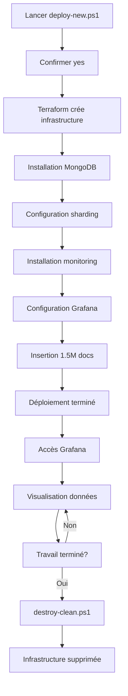

# MongoDB Sharded Cluster - AWS Multi-Region

Infrastructure MongoDB shardée automatisée sur 3 régions AWS avec monitoring en temps réel.

## 🚀 Démarrage Rapide

### **Déploiement Complet (20-30 minutes)**

```powershell
# 1. Ouvrir PowerShell dans ce répertoire
cd C:\Users\<username>\Desktop\lot\mongodb-cluster

# 2. Lancer le déploiement
.\deploy-new.ps1

# 3. Confirmer avec "yes"

# 4. Attendre ~25 minutes
```

### **Destruction Complète (5-10 minutes)**

```powershell
# 1. Lancer la destruction
.\destroy-clean.ps1

# 2. Confirmer avec "yes"
# 3. Confirmer avec "DESTROY"
```

**Si destruction échoue:**
```powershell
.\destroy-force.ps1
```

---

## 📊 Ce Que Vous Obtenez

✅ **Infrastructure AWS:**
- 3 VPC multi-régions (US-EAST-1, EU-WEST-1, AP-SOUTH-1)
- VPC Peering cross-région
- 4 instances EC2 t3.micro (Free Tier)

✅ **MongoDB Cluster:**
- 3 Shards (un par région)
- 3 Config Servers (replica set)
- 3 Mongos Routers
- **1.5 million de documents** pré-insérés (~1.5 GB)
- Sharding automatique configuré

✅ **Monitoring:**
- Prometheus (collecte métriques)
- Grafana (dashboards)
  - Dashboard MongoDB (ID 2583)
  - Dashboard personnalisé
- Exporters MongoDB sur chaque nœud

---

## 🎯 Accès et Visualisation

### **Grafana** (après déploiement)

```
URL:      http://<monitoring_ip>:3000
Login:    admin
Password: admin123
```

**Dashboards disponibles:**
- MongoDB Exporter (métriques détaillées)
- MongoDB Sharded Cluster - Overview (personnalisé)

**Récupérer l'IP de monitoring:**
```powershell
# Depuis le fichier de connexion
cat CONNEXION-INFO.txt

# Ou depuis Terraform
(terraform output -json | ConvertFrom-Json).cluster_ips.value.monitoring.public
```

---

## 📈 Monitoring de l'Insertion en Temps Réel

Pendant le déploiement, surveillez l'insertion des données:

### **Option 1: Script de monitoring intégré**
```powershell
.\monitor-insertion.ps1
```

Choisissez parmi:
1. **Logs en direct** (tail -f)
2. **Compteur temps réel** (mise à jour 10s)
3. **Mode parallèle** (les deux)

### **Option 2: Compteur simple**
```powershell
$US_IP = (Get-Content terraform.tfstate | ConvertFrom-Json).outputs.cluster_ips.value.us.public

while ($true) {
    $count = ssh -i ~/.ssh/id_rsa_mongodb-sharded-cluster bigdata@$US_IP "mongosh --port 27017 --quiet --eval 'db.getSiblingDB(\`"sensordb\`").readings.countDocuments({})' 2>/dev/null"
    
    $timestamp = Get-Date -Format "HH:mm:ss"
    Write-Host "[$timestamp] Documents insérés: $count" -ForegroundColor Green
    
    Start-Sleep -Seconds 10
}
```

### **Option 3: Logs détaillés**
```powershell
ssh -i ~/.ssh/id_rsa_mongodb-sharded-cluster bigdata@<us_ip> "tail -f /tmp/insertion.log"
```

---

## 🔧 Scripts Disponibles

| Script | Description | Durée |
|--------|-------------|-------|
| `deploy-new.ps1` | Déploiement complet de l'infrastructure | 20-30 min |
| `destroy-clean.ps1` | Destruction propre avec vérifications | 5-10 min |
| `destroy-force.ps1` | Destruction forcée (en cas d'urgence) | 5-10 min |
| `apply-grafana-config.ps1` | Configure Grafana sur infra existante | 1 min |
| `monitor-insertion.ps1` | Monitoring temps réel de l'insertion | - |
| `cleanup-obsolete.ps1` | Nettoie fichiers obsolètes | 1 min |

---

## 🗂️ Structure du Projet

```
mongodb-cluster/
├── 📄 Terraform (13 fichiers .tf)
│   ├── versions.tf              # Versions providers
│   ├── providers.tf             # Configuration AWS multi-région
│   ├── variables.tf             # Variables configurables
│   ├── locals.tf                # Variables locales
│   ├── network.tf               # VPC, subnets, IGW
│   ├── network-fixes.tf         # VPC peering EU-AP
│   ├── ssh-keys.tf              # Clés SSH AWS
│   ├── security-groups.tf       # Security groups
│   ├── mongodb-nodes.tf         # Instances EC2 MongoDB
│   ├── provisioning.tf          # Config MongoDB + exporters
│   ├── monitoring.tf            # Instance monitoring
│   ├── grafana-auto-config.tf   # Config auto Grafana
│   ├── auto-insert-data.tf      # Insertion automatique
│   └── outputs.tf               # Outputs (IPs, commandes)
│
├── 🔧 Scripts PowerShell
│   ├── deploy-new.ps1
│   ├── destroy-clean.ps1
│   ├── destroy-force.ps1
│   ├── apply-grafana-config.ps1
│   ├── monitor-insertion.ps1
│   └── cleanup-obsolete.ps1
│
├── 📂 scripts/
│   └── insert-data.py           # Script Python insertion
│
├── 📂 templates/
│   ├── cloud-init-mongodb.yml.tpl
│   └── cloud-init-monitoring.yml.tpl
│
├── 📖 README.md                 # Ce fichier
└── 📖 SCRIPTS-DISPONIBLES.txt   # Liste scripts
```

---

## 🏗️ Architecture Détaillée

### **Sharding MongoDB**

```
┌─────────────────────────────────────────────────────────────────┐
│                    COLLECTION: sensordb.readings                │
│                 (shardée par sensor_id: hashed)                 │
└─────────────────────────────────────────────────────────────────┘

CHUNK 1-2: shard1RS (US-EAST-1)   ← ~500k documents
CHUNK 3-4: shard2RS (EU-WEST-1)   ← ~500k documents
CHUNK 5-6: shard3RS (AP-SOUTH-1)  ← ~500k documents
```

### **Réseau**

```
US-EAST-1 (10.0.0.0/24)  ←─────┐
    ↓                           │
    ├─→ VPC Peering ←───────────┼─→ EU-WEST-1 (10.1.0.0/24)
    │                           │         ↓
    │                           │         ├─→ VPC Peering
    │                           │         │
    └─→ VPC Peering ←───────────┴─────────┴─→ AP-SOUTH-1 (10.2.0.0/24)
```

### **Ports**

| Service | Port | Description |
|---------|------|-------------|
| Mongos | 27017 | Router MongoDB |
| Shard | 27018 | Serveur de données |
| Config | 27019 | Config server |
| Prometheus | 9090 | Collecte métriques |
| Grafana | 3000 | Dashboards |
| Exporter | 9216 | Métriques MongoDB |

---

## 💡 Commandes Utiles

### **Connexion SSH**
```powershell
# Via fichier de connexion
cat CONNEXION-INFO.txt

# Connexion directe
ssh -i ~/.ssh/id_rsa_mongodb-sharded-cluster bigdata@<ip>
```

### **MongoDB - Vérifications**
```javascript
// Compter les documents
mongosh --port 27017 --eval "db.getSiblingDB('sensordb').readings.countDocuments({})"

// Statut du cluster
mongosh --port 27017 --eval "sh.status()"

// Distribution par shard
mongosh --port 27017 --eval "use config; db.chunks.aggregate([{$group: {_id: '\$shard', count: {$sum: 1}}}])"

// Voir des exemples de données
mongosh --port 27017 --eval "db.getSiblingDB('sensordb').readings.find().limit(5).pretty()"
```

### **Terraform - Gestion**
```powershell
# Voir les outputs
terraform output

# Voir une IP spécifique
terraform output cluster_ips

# Rafraîchir le state
terraform refresh

# Voir le plan
terraform plan
```

---

## 🔐 Prérequis

### **Système**
- Windows 10/11 avec PowerShell 5.1+
- OU Linux/Mac avec Bash

### **Outils**
- [Terraform](https://www.terraform.io/downloads) (≥ 1.0)
- [AWS CLI](https://aws.amazon.com/cli/) configuré
- Compte AWS Free Tier

### **Configuration AWS**
```powershell
# Configurer les credentials
aws configure

# Vérifier
aws sts get-caller-identity
```

### **Clé SSH**
La clé SSH est générée automatiquement si absente:
```
~/.ssh/id_rsa_mongodb-sharded-cluster
~/.ssh/id_rsa_mongodb-sharded-cluster.pub
```

---

## 🐛 Dépannage

### **Erreur: Terraform not found**
```powershell
# Installer Terraform
choco install terraform
# OU télécharger depuis terraform.io
```

### **Erreur: AWS credentials not configured**
```powershell
aws configure
# Entrer: Access Key ID, Secret Access Key, Region (us-east-1)
```

### **Erreur: SSH connection refused**
- Attendre 2-3 minutes après le déploiement
- Vérifier les security groups dans AWS Console

### **Erreur: Terraform state lock**
```powershell
# Forcer le unlock
terraform force-unlock <lock-id>
```

### **Erreur: Destruction échoue**
```powershell
# Utiliser la destruction forcée
.\destroy-force.ps1
```

---

## 📝 Variables Configurables

Éditez `variables.tf` pour personnaliser:

```hcl
variable "project_name" {
  default = "mongodb-sharded-cluster"
}

variable "instance_type" {
  default = "t3.micro"  # Free Tier
}

variable "volume_size" {
  default = 30  # GB
}

variable "grafana_admin_password" {
  default = "admin123"  # À CHANGER EN PROD!
}
```

---

## 📚 Documentation Complémentaire

- **SCRIPTS-DISPONIBLES.txt** - Liste détaillée des scripts
- [MongoDB Sharding Docs](https://docs.mongodb.com/manual/sharding/)
- [Terraform AWS Provider](https://registry.terraform.io/providers/hashicorp/aws/latest/docs)
- [Grafana Dashboard 2583](https://grafana.com/grafana/dashboards/2583)

---

## 🎯 Workflow Complet



---

## 🤝 Contribution

1. Fork le projet
2. Créer une branche (`git checkout -b feature/amelioration`)
3. Commit (`git commit -m 'Ajout fonctionnalité'`)
4. Push (`git push origin feature/amelioration`)
5. Ouvrir une Pull Request

---

## 📄 Licence

Ce projet est sous licence MIT. Voir `LICENSE` pour plus de détails.

---

## ✨ Auteur

Développé pour démontrer:
- Infrastructure as Code (Terraform)
- MongoDB Sharding multi-région
- Monitoring distribué (Prometheus/Grafana)
- Automatisation complète du déploiement

---

**🚀 Prêt à déployer? Lancez maintenant:**

```powershell
.\deploy-new.ps1
```
